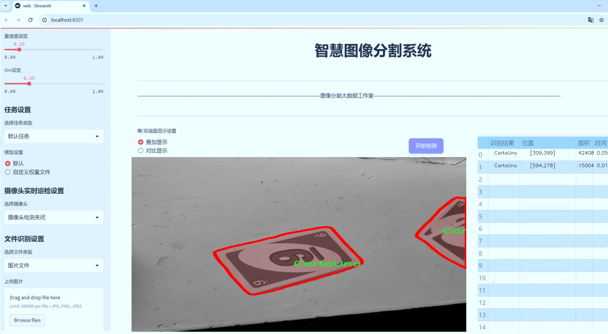
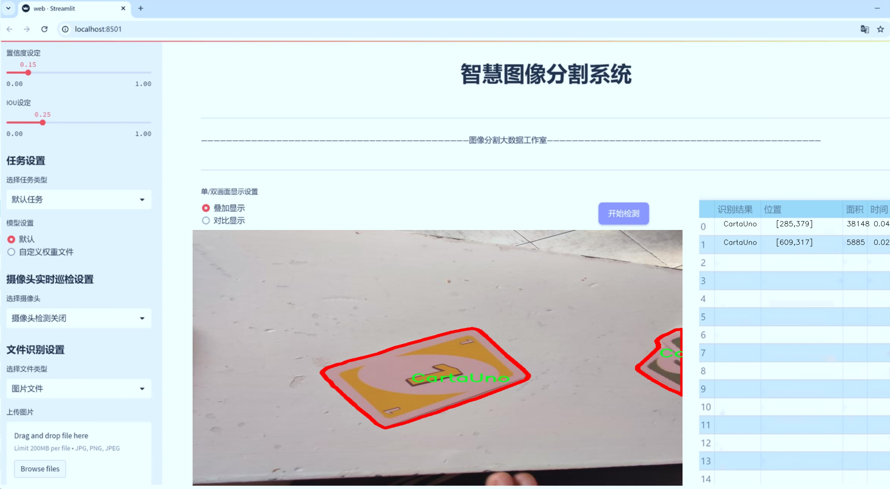
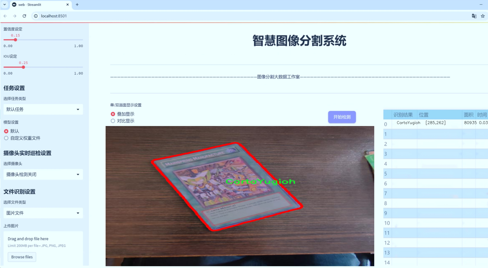
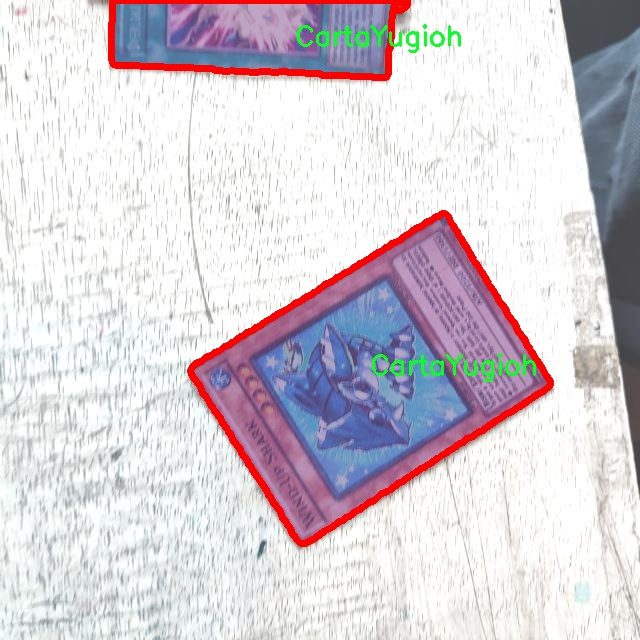
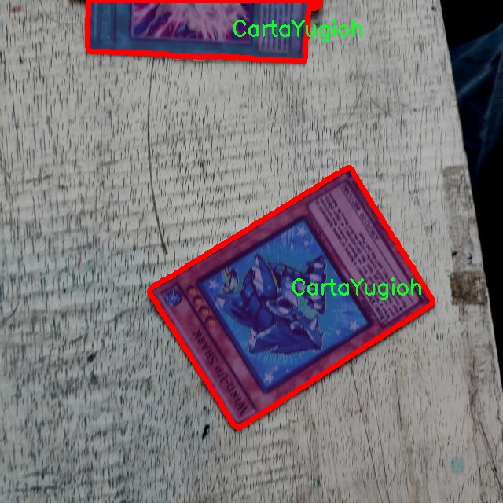
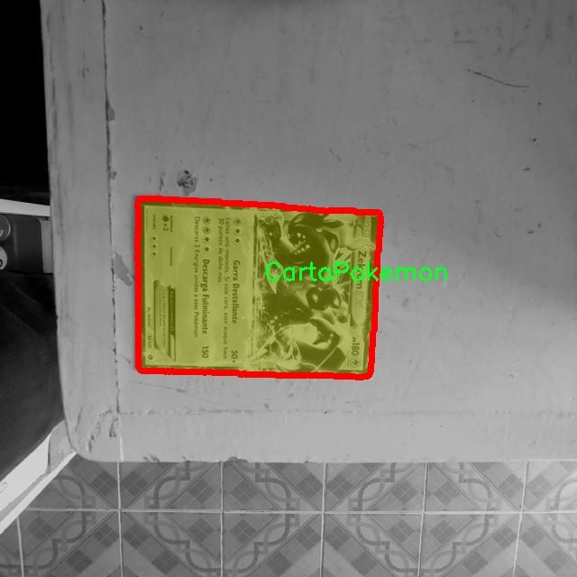
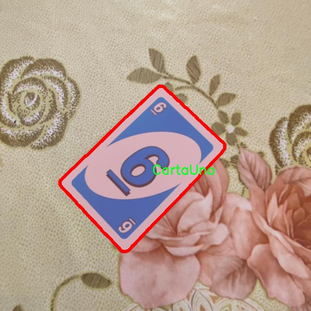
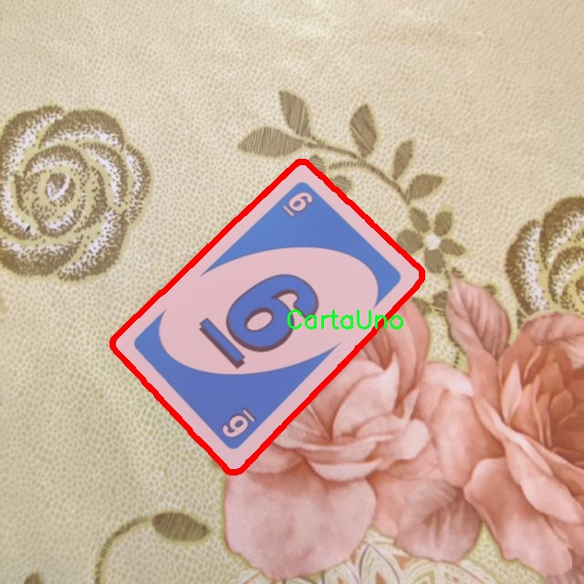

# 卡牌图像分割系统源码＆数据集分享
 [yolov8-seg-convnextv2＆yolov8-seg-EfficientFormerV2等50+全套改进创新点发刊_一键训练教程_Web前端展示]

### 1.研究背景与意义

项目参考[ILSVRC ImageNet Large Scale Visual Recognition Challenge](https://gitee.com/YOLOv8_YOLOv11_Segmentation_Studio/projects)

项目来源[AAAI Global Al lnnovation Contest](https://kdocs.cn/l/cszuIiCKVNis)

研究背景与意义

随着计算机视觉技术的迅猛发展，图像分割作为其中的重要研究方向，逐渐在多个领域中展现出其广泛的应用潜力。尤其是在游戏产业和卡牌收集领域，图像分割技术的应用愈发显得重要。卡牌游戏因其丰富的视觉元素和复杂的游戏机制，成为了计算机视觉研究的一个新兴热点。近年来，基于深度学习的目标检测与分割算法，尤其是YOLO（You Only Look Once）系列模型，因其高效性和准确性，受到广泛关注。YOLOv8作为该系列的最新版本，具备了更强的特征提取能力和实时处理能力，为卡牌图像的分割提供了新的技术支持。

本研究旨在基于改进的YOLOv8模型，构建一个高效的卡牌图像分割系统。我们使用的数据集包含1200张图像，涵盖了四类卡牌：Pokemon卡牌、Poker卡牌、Uno卡牌和Yugioh卡牌。这些卡牌在视觉特征上具有显著差异，既包括色彩、形状和图案等静态特征，也涉及到卡牌的动态交互和游戏场景的复杂性。因此，开发一个能够准确分割和识别这些卡牌的系统，不仅能够提升游戏体验，还能为相关的研究提供数据支持。

卡牌图像分割系统的研究意义主要体现在以下几个方面。首先，准确的图像分割能够为卡牌游戏的自动化处理提供基础支持。例如，在增强现实（AR）和虚拟现实（VR）环境中，玩家可以通过摄像头扫描现实中的卡牌，系统能够实时识别并呈现相应的游戏效果，从而提升用户体验。其次，随着卡牌游戏的数字化趋势，开发高效的图像分割系统能够为卡牌的数字化管理和交易提供技术保障，促进二手市场的繁荣。

此外，卡牌图像分割系统的研究还具有重要的学术价值。通过对不同类型卡牌的特征分析和模型优化，我们可以深入探讨图像分割技术在复杂场景下的应用潜力，推动计算机视觉领域的进一步发展。同时，本研究也为后续的图像识别、分类等相关研究提供了基础数据和模型支持，促进跨领域的学术交流与合作。

综上所述，基于改进YOLOv8的卡牌图像分割系统的研究，不仅在技术上具有创新性和实用性，更在理论和应用层面上为计算机视觉领域的研究提供了新的视角和思路。通过本研究，我们期望能够推动卡牌游戏及其相关产业的发展，同时为计算机视觉技术的进步贡献一份力量。

### 2.图片演示







##### 注意：由于此博客编辑较早，上面“2.图片演示”和“3.视频演示”展示的系统图片或者视频可能为老版本，新版本在老版本的基础上升级如下：（实际效果以升级的新版本为准）

  （1）适配了YOLOV8的“目标检测”模型和“实例分割”模型，通过加载相应的权重（.pt）文件即可自适应加载模型。

  （2）支持“图片识别”、“视频识别”、“摄像头实时识别”三种识别模式。

  （3）支持“图片识别”、“视频识别”、“摄像头实时识别”三种识别结果保存导出，解决手动导出（容易卡顿出现爆内存）存在的问题，识别完自动保存结果并导出到tempDir中。

  （4）支持Web前端系统中的标题、背景图等自定义修改，后面提供修改教程。

  另外本项目提供训练的数据集和训练教程,暂不提供权重文件（best.pt）,需要您按照教程进行训练后实现图片演示和Web前端界面演示的效果。

### 3.视频演示

[3.1 视频演示](https://www.bilibili.com/video/BV1y4yTYCE5U/)

### 4.数据集信息展示

##### 4.1 本项目数据集详细数据（类别数＆类别名）

nc: 4
names: ['CartaPokemon', 'CartaPoker', 'CartaUno', 'CartaYugioh']


##### 4.2 本项目数据集信息介绍

数据集信息展示

在本研究中，我们使用了名为“Cartas”的数据集，以支持对卡牌图像分割系统的训练，特别是针对改进YOLOv8-seg模型的应用。该数据集的设计旨在涵盖多种类型的卡牌，提供丰富的样本以增强模型的学习能力和泛化能力。Cartas数据集包含四个主要类别，分别是：CartaPokemon、CartaPoker、CartaUno和CartaYugioh。这些类别不仅反映了不同类型卡牌的多样性，还体现了各类卡牌在视觉特征和结构上的差异，为模型的训练提供了良好的基础。

首先，CartaPokemon类别主要包括各种宝可梦卡牌，这些卡牌通常具有鲜艳的色彩和复杂的图案，能够有效地测试模型在处理多样化视觉特征时的能力。宝可梦卡牌的设计风格独特，包含丰富的角色和背景元素，这为图像分割任务提供了挑战，同时也有助于模型学习如何在复杂背景中准确识别和分割目标。

其次，CartaPoker类别则涵盖了经典的扑克牌。这类卡牌的设计相对简单，主要由数字和花色组成。尽管视觉元素较少，但扑克牌的标准化设计使得模型能够学习到基本的图像分割技术，尤其是在处理相似形状和颜色的情况下。通过对扑克牌的训练，模型可以掌握如何在相对简单的环境中进行有效的分割，为后续处理更复杂的卡牌类型打下基础。

接下来，CartaUno类别则代表了Uno游戏中的卡牌，这些卡牌通常具有鲜艳的颜色和标志性的图案，设计上相对简单但多样化。Uno卡牌的特点在于其颜色和数字的组合，模型在处理这类卡牌时，不仅需要识别颜色，还需理解不同颜色之间的关系和分割逻辑。这为模型的学习提供了多样化的挑战，有助于提升其在实际应用中的表现。

最后，CartaYugioh类别包含了游戏王卡牌，这些卡牌通常具有复杂的插图和丰富的背景故事。游戏王卡牌的设计往往包含大量的细节，模型在处理这类卡牌时需要具备更高的分割精度和对细节的敏感性。这一类别的卡牌为模型提供了丰富的学习样本，帮助其在面对复杂视觉信息时，能够更好地进行特征提取和目标分割。

综上所述，Cartas数据集通过涵盖多种类型的卡牌，为改进YOLOv8-seg的图像分割系统提供了丰富的训练素材。每个类别的独特特征和设计风格，不仅为模型的训练提供了多样化的挑战，也为其在实际应用中的表现奠定了坚实的基础。通过对这些卡牌的深入学习，模型将能够在各种复杂场景中实现高效的图像分割，为卡牌识别和相关应用提供强有力的支持。











### 5.全套项目环境部署视频教程（零基础手把手教学）

[5.1 环境部署教程链接（零基础手把手教学）](https://www.bilibili.com/video/BV1jG4Ve4E9t/?vd_source=bc9aec86d164b67a7004b996143742dc)


[5.2 安装Python虚拟环境创建和依赖库安装视频教程链接（零基础手把手教学）](https://www.bilibili.com/video/BV1nA4VeYEze/?vd_source=bc9aec86d164b67a7004b996143742dc)

### 6.手把手YOLOV8-seg训练视频教程（零基础小白有手就能学会）

[6.1 手把手YOLOV8-seg训练视频教程（零基础小白有手就能学会）](https://www.bilibili.com/video/BV1cA4VeYETe/?vd_source=bc9aec86d164b67a7004b996143742dc)


按照上面的训练视频教程链接加载项目提供的数据集，运行train.py即可开始训练



     Epoch   gpu_mem       box       obj       cls    labels  img_size
     1/200     0G   0.01576   0.01955  0.007536        22      1280: 100%|██████████| 849/849 [14:42<00:00,  1.04s/it]
               Class     Images     Labels          P          R     mAP@.5 mAP@.5:.95: 100%|██████████| 213/213 [01:14<00:00,  2.87it/s]
                 all       3395      17314      0.994      0.957      0.0957      0.0843

     Epoch   gpu_mem       box       obj       cls    labels  img_size
     2/200     0G   0.01578   0.01923  0.007006        22      1280: 100%|██████████| 849/849 [14:44<00:00,  1.04s/it]
               Class     Images     Labels          P          R     mAP@.5 mAP@.5:.95: 100%|██████████| 213/213 [01:12<00:00,  2.95it/s]
                 all       3395      17314      0.996      0.956      0.0957      0.0845

     Epoch   gpu_mem       box       obj       cls    labels  img_size
     3/200     0G   0.01561    0.0191  0.006895        27      1280: 100%|██████████| 849/849 [10:56<00:00,  1.29it/s]
               Class     Images     Labels          P          R     mAP@.5 mAP@.5:.95: 100%|███████   | 187/213 [00:52<00:00,  4.04it/s]
                 all       3395      17314      0.996      0.957      0.0957      0.0845


### 7.50+种全套YOLOV8-seg创新点代码加载调参视频教程（一键加载写好的改进模型的配置文件）

[7.1 50+种全套YOLOV8-seg创新点代码加载调参视频教程（一键加载写好的改进模型的配置文件）](https://www.bilibili.com/video/BV1Hw4VePEXv/?vd_source=bc9aec86d164b67a7004b996143742dc)

### 8.YOLOV8-seg图像分割算法原理

原始YOLOv8-seg算法原理

YOLOv8-seg算法是YOLO系列的最新版本，专注于目标检测与分割任务，结合了深度学习的先进技术，展现出卓越的性能与灵活性。该算法的设计理念是以高效的特征提取和精确的目标检测为核心，力求在多种应用场景中提供快速而准确的解决方案。YOLOv8-seg不仅延续了YOLO系列的优良传统，还在模型架构、特征提取、目标检测等方面进行了创新与改进。

首先，YOLOv8-seg的网络结构主要由三个部分组成：Backbone、Neck和Head。Backbone部分负责从输入图像中提取特征，采用了CSPDarknet（Cross Stage Partial Darknet）结构。这种结构将网络分为两个部分，每个部分均包含多个残差块，能够有效地捕捉图像中的细节信息。与前代模型YOLOv5相比，YOLOv8-seg引入了C2f模块替代了C3模块，C2f模块通过将输入特征图分为两个分支并分别进行卷积处理，显著提高了特征提取的效率和精度。每个分支的输出再通过卷积层进行融合，从而形成更高维度的特征图，这种设计不仅增强了模型的梯度流信息，还提升了特征的表达能力。

在特征提取的过程中，YOLOv8-seg还引入了快速空间金字塔池化（SPPF）结构，旨在提取不同尺度的特征。这一创新使得模型在处理多尺度目标时表现得更加出色，能够有效减少参数量和计算量，同时提高特征提取的效率。通过这种高效的特征提取机制，YOLOv8-seg能够在复杂的视觉环境中准确识别和分割目标。

接下来，Neck部分的设计采用了特征金字塔网络（FPN）与路径聚合网络（PAN）的结合。这一结构通过多个卷积层和池化层对特征图进行处理和压缩，进一步提升了特征的表达能力和检测的准确性。Neck部分的主要任务是将来自Backbone的多层特征进行融合，以便在后续的目标检测阶段能够利用到丰富的上下文信息。通过这种多尺度特征融合，YOLOv8-seg能够在不同的层次上捕捉到目标的特征，从而提高了对小目标和复杂场景的检测能力。

在目标检测部分，YOLOv8-seg采用了一种基于无锚框（Anchor-Free）的检测方式。这种方法直接预测目标的中心点和宽高比例，省去了传统锚框的设计与调优过程，极大地提高了检测速度和准确度。无锚框的设计理念使得模型在处理不同形状和大小的目标时更加灵活，能够自适应地调整检测策略，从而提高了整体的检测性能。

YOLOv8-seg还引入了解耦头结构，这一设计使得模型在处理目标检测任务时能够更加高效。解耦头结构的优势在于能够将不同的任务（如分类、定位和分割）分开处理，从而提高了模型的可扩展性和灵活性。此外，YOLOv8-seg使用了CloU损失函数，这一损失函数能够有效地优化模型的训练过程，提升检测精度。

在模型设置方面，YOLOv8-seg提供了多种参数配置选项，如depth_factor、width_factor和ratio等。这些参数的设置可以根据具体的应用需求进行调整，以实现模型的深度和宽度的动态变化。通过合理的参数配置，用户可以在保证检测精度的前提下，优化模型的推理速度和计算资源的使用效率。

总的来说，YOLOv8-seg算法在目标检测与分割领域展现出了强大的能力。其高效的特征提取机制、灵活的目标检测策略以及创新的网络结构设计，使得YOLOv8-seg在多种应用场景中都能够实现快速而准确的目标识别与分割。随着YOLOv8-seg的不断发展与完善，预计将在智能监控、自动驾驶、医学影像分析等领域发挥越来越重要的作用。通过不断的技术迭代与创新，YOLOv8-seg无疑将成为目标检测与分割领域的一个重要里程碑，推动相关技术的进步与应用的普及。


### 9.系统功能展示（检测对象为举例，实际内容以本项目数据集为准）

图9.1.系统支持检测结果表格显示

  图9.2.系统支持置信度和IOU阈值手动调节

  图9.3.系统支持自定义加载权重文件best.pt(需要你通过步骤5中训练获得)

  图9.4.系统支持摄像头实时识别

  图9.5.系统支持图片识别

  图9.6.系统支持视频识别

  图9.7.系统支持识别结果文件自动保存

  图9.8.系统支持Excel导出检测结果数据


### 10.50+种全套YOLOV8-seg创新点原理讲解（非科班也可以轻松写刊发刊，V11版本正在科研待更新）

#### 10.1 由于篇幅限制，每个创新点的具体原理讲解就不一一展开，具体见下列网址中的创新点对应子项目的技术原理博客网址【Blog】：


[10.1 50+种全套YOLOV8-seg创新点原理讲解链接](https://gitee.com/qunmasj/good)

#### 10.2 部分改进模块原理讲解(完整的改进原理见上图和技术博客链接)【如果此小节的图加载失败可以通过CSDN或者Github搜索该博客的标题访问原始博客，原始博客图片显示正常】
### FasterNet简介
神经网络在图像分类、检测和分割等各种计算机视觉任务中经历了快速发展。尽管其令人印象深刻的性能为许多应用程序提供了动力，但一个巨大的趋势是追求具有低延迟和高吞吐量的快速神经网络，以获得良好的用户体验、即时响应和安全原因等。

如何快速？研究人员和从业者不需要更昂贵的计算设备，而是倾向于设计具有成本效益的快速神经网络，降低计算复杂度，主要以浮点运算（FLOPs）的数量来衡量。

MobileNet、ShuffleNet和GhostNet等利用深度卷积（DWConv）和/或组卷积（GConv）来提取空间特征。然而，在减少FLOPs的过程中，算子经常会受到内存访问增加的副作用的影响。MicroNet进一步分解和稀疏网络，将其FLOPs推至极低水平。尽管这种方法在FLOPs方面有所改进，但其碎片计算效率很低。此外，上述网络通常伴随着额外的数据操作，如级联、Shuffle和池化，这些操作的运行时间对于小型模型来说往往很重要。

除了上述纯卷积神经网络（CNNs）之外，人们对使视觉Transformer（ViTs）和多层感知器（MLP）架构更小更快也越来越感兴趣。例如，MobileViT和MobileFormer通过将DWConv与改进的注意力机制相结合，降低了计算复杂性。然而，它们仍然受到DWConv的上述问题的困扰，并且还需要修改的注意力机制的专用硬件支持。使用先进但耗时的标准化和激活层也可能限制其在设备上的速度。

所有这些问题一起导致了以下问题：这些“快速”的神经网络真的很快吗？为了回答这个问题，作者检查了延迟和FLOPs之间的关系，这由


其中FLOPS是每秒浮点运算的缩写，作为有效计算速度的度量。虽然有许多减少FLOPs的尝试，但都很少考虑同时优化FLOPs以实现真正的低延迟。为了更好地理解这种情况，作者比较了Intel CPU上典型神经网络的FLOPS。


图中的结果表明，许多现有神经网络的FLOPS较低，其FLOPS通常低于流行的ResNet50。由于FLOPS如此之低，这些“快速”的神经网络实际上不够快。它们的FLOPs减少不能转化为延迟的确切减少量。在某些情况下，没有任何改善，甚至会导致更糟的延迟。例如，CycleMLP-B1具有ResNet50的一半FLOPs，但运行速度较慢（即CycleMLPB1与ResNet50:111.9ms与69.4ms）。

请注意，FLOPs与延迟之间的差异在之前的工作中也已被注意到，但由于它们采用了DWConv/GConv和具有低FLOPs的各种数据处理，因此部分问题仍未解决。人们认为没有更好的选择。

该博客提供的方案通过开发一种简单、快速、有效的运算符来消除这种差异，该运算符可以在减少FLOPs的情况下保持高FLOPS。

具体来说，作者重新审视了现有的操作符，特别是DWConv的计算速度——FLOPS。作者发现导致低FLOPS问题的主要原因是频繁的内存访问。然后，作者提出了PConv作为一种竞争性替代方案，它减少了计算冗余以及内存访问的数量。

图1说明了PConv的设计。它利用了特征图中的冗余，并系统地仅在一部分输入通道上应用规则卷积（Conv），而不影响其余通道。本质上，PConv的FLOPs低于常规Conv，而FLOPs高于DWConv/GConv。换句话说，PConv更好地利用了设备上的计算能力。PConv在提取空间特征方面也很有效，这在本文后面的实验中得到了验证。

作者进一步引入PConv设计了FasterNet作为一个在各种设备上运行速度非常快的新网络家族。特别是，FasterNet在分类、检测和分割任务方面实现了最先进的性能，同时具有更低的延迟和更高的吞吐量。例如，在GPU、CPU和ARM处理器上，小模型FasterNet-T0分别比MobileVitXXS快3.1倍、3.1倍和2.5倍，而在ImageNet-1k上的准确率高2.9%。大模型FasterNet-L实现了83.5%的Top-1精度，与Swin-B不相上下，同时在GPU上提供了49%的高吞吐量，在CPU上节省了42%的计算时间。

总之，贡献如下：

指出了实现更高FLOPS的重要性，而不仅仅是为了更快的神经网络而减少FLOPs。

引入了一种简单但快速且有效的卷积PConv，它很有可能取代现有的选择DWConv。

推出FasterNet，它在GPU、CPU和ARM处理器等多种设备上运行良好且普遍快速。

对各种任务进行了广泛的实验，并验证了PConv和FasterNet的高速性和有效性。

### Conv和FasterNet的设计
#### 原理

DWConv是Conv的一种流行变体，已被广泛用作许多神经网络的关键构建块。对于输入，DWConv应用个滤波器来计算输出。如图（b）所示，每个滤波器在一个输入通道上进行空间滑动，并对一个输出通道做出贡献。

与具有的FLOPs常规Conv相比，这种深度计算使得DWConv仅仅具有的FLOPs。虽然在减少FLOPs方面有效，但DWConv（通常后跟逐点卷积或PWConv）不能简单地用于替换常规Conv，因为它会导致严重的精度下降。因此，在实践中，DWConv的通道数（或网络宽度）增加到＞以补偿精度下降，例如，倒置残差块中的DWConv宽度扩展了6倍。然而，这会导致更高的内存访问，这会造成不可忽略的延迟，并降低总体计算速度，尤其是对于I/O绑定设备。特别是，内存访问的数量现在上升到


它比一个常规的Conv的值要高，即，


注意，内存访问花费在I/O操作上，这被认为已经是最小的成本，很难进一步优化。

#### PConv作为一个基本的算子


在下面演示了通过利用特征图的冗余度可以进一步优化成本。如图所示，特征图在不同通道之间具有高度相似性。许多其他著作也涵盖了这种冗余，但很少有人以简单而有效的方式充分利用它。


具体而言，作者提出了一种简单的PConv，以同时减少计算冗余和内存访问。图4中的左下角说明了PConv的工作原理。它只需在输入通道的一部分上应用常规Conv进行空间特征提取，并保持其余通道不变。对于连续或规则的内存访问，将第一个或最后一个连续的通道视为整个特征图的代表进行计算。在不丧失一般性的情况下认为输入和输出特征图具有相同数量的通道。因此，PConv的FLOPs仅


对于典型的r＝1/4 ，PConv的FLOPs只有常规Conv的1/16。此外，PConv的内存访问量较小，即：


对于r＝1/4，其仅为常规Conv的1/4。

由于只有通道用于空间特征提取，人们可能会问是否可以简单地移除剩余的（c−）通道？如果是这样，PConv将退化为具有较少通道的常规Conv，这偏离了减少冗余的目标。

请注意，保持其余通道不变，而不是从特征图中删除它们。这是因为它们对后续PWConv层有用，PWConv允许特征信息流经所有通道。

#### PConv之后是PWConv


为了充分有效地利用来自所有通道的信息，进一步将逐点卷积（PWConv）附加到PConv。它们在输入特征图上的有效感受野看起来像一个T形Conv，与均匀处理补丁的常规Conv相比，它更专注于中心位置，如图5所示。为了证明这个T形感受野的合理性，首先通过计算位置的Frobenius范数来评估每个位置的重要性。


假设，如果一个职位比其他职位具有更大的Frobenius范数，则该职位往往更重要。对于正则Conv滤波器，位置处的Frobenius范数由计算，其中。


一个显著位置是具有最大Frobenius范数的位置。然后，在预训练的ResNet18中集体检查每个过滤器，找出它们的显著位置，并绘制显著位置的直方图。图6中的结果表明，中心位置是过滤器中最常见的突出位置。换句话说，中心位置的权重比周围的更重。这与集中于中心位置的T形计算一致。

虽然T形卷积可以直接用于高效计算，但作者表明，将T形卷积分解为PConv和PWConv更好，因为该分解利用了滤波器间冗余并进一步节省了FLOPs。对于相同的输入和输出，T形Conv的FLOPs可以计算为:


它高于PConv和PWConv的流量，即：


其中和（例如，当时）。此外，可以很容易地利用常规Conv进行两步实现。

# FasterNet作为Backbone
鉴于新型PConv和现成的PWConv作为主要的算子，进一步提出FasterNet，这是一个新的神经网络家族，运行速度非常快，对许多视觉任务非常有效。目标是使体系结构尽可能简单，使其总体上对硬件友好。


在图中展示了整体架构。它有4个层次级，每个层次级前面都有一个嵌入层（步长为4的常规4×4卷积）或一个合并层（步长为2的常规2×2卷积），用于空间下采样和通道数量扩展。每个阶段都有一堆FasterNet块。作者观察到，最后两个阶段中的块消耗更少的内存访问，并且倾向于具有更高的FLOPS，如表1中的经验验证。因此，放置了更多FasterNet块，并相应地将更多计算分配给最后两个阶段。每个FasterNet块有一个PConv层，后跟2个PWConv（或Conv 1×1）层。它们一起显示为倒置残差块，其中中间层具有扩展的通道数量，并且放置了Shorcut以重用输入特征。

除了上述算子，标准化和激活层对于高性能神经网络也是不可或缺的。然而，许多先前的工作在整个网络中过度使用这些层，这可能会限制特征多样性，从而损害性能。它还可以降低整体计算速度。相比之下，只将它们放在每个中间PWConv之后，以保持特征多样性并实现较低的延迟。

此外，使用批次归一化（BN）代替其他替代方法。BN的优点是，它可以合并到其相邻的Conv层中，以便更快地进行推断，同时与其他层一样有效。对于激活层，根据经验选择了GELU用于较小的FasterNet变体，而ReLU用于较大的FasterNet变体，同时考虑了运行时间和有效性。最后三个层，即全局平均池化、卷积1×1和全连接层，一起用于特征转换和分类。

为了在不同的计算预算下提供广泛的应用，提供FasterNet的Tiny模型、Small模型、Medium模型和Big模型变体，分别称为FasterNetT0/1/2、FasterNet-S、FasterNet-M和FasterNet-L。它们具有相似的结构，但深度和宽度不同。

架构规范如下：


### 11.项目核心源码讲解（再也不用担心看不懂代码逻辑）

#### 11.1 ultralytics\models\utils\__init__.py

由于您提供的代码片段非常有限，仅包含一行注释，无法进行逐文件分析或提取核心部分。不过，我可以为您解释这行代码的含义，并提供一些关于Ultralytics YOLO的背景信息。

```python
# Ultralytics YOLO 🚀, AGPL-3.0 license
```

### 代码解析

1. **Ultralytics YOLO**: 
   - 这是一个开源的目标检测模型，基于YOLO（You Only Look Once）架构。YOLO是一种实时目标检测系统，能够在图像中快速准确地识别和定位多个对象。

2. **🚀**: 
   - 这个符号通常表示速度和高效性，暗示Ultralytics YOLO在性能和速度方面的优势。

3. **AGPL-3.0 license**: 
   - 这是一个开源许可证，称为“GNU Affero General Public License v3.0”。它允许用户自由使用、修改和分发软件，但要求任何分发的修改版本也必须在相同的许可证下发布。这确保了软件的开源特性得以保留。

### 背景信息

Ultralytics YOLO是一个非常流行的目标检测库，广泛应用于计算机视觉任务，如视频监控、自动驾驶、工业检测等。它提供了易于使用的API和预训练模型，使得开发者能够快速上手并进行定制化开发。

如果您有更多具体的代码或文件需要分析，请提供更详细的内容，我将乐意为您提供进一步的帮助。

该文件是Ultralytics YOLO项目的一部分，文件路径为`ultralytics/models/utils/__init__.py`。从文件名和路径可以推测，这个文件主要用于初始化`utils`模块。文件的开头包含了一行注释，表明该项目使用的是AGPL-3.0许可证，并且与Ultralytics YOLO有关。

在Python中，`__init__.py`文件的主要作用是将包含该文件的目录标识为一个包，使得该目录下的模块可以被导入。虽然在你提供的代码中只有一行注释，但通常在`__init__.py`文件中可能会包含一些导入语句、模块的初始化代码或是对外暴露的API。

在Ultralytics YOLO的上下文中，`utils`模块可能包含一些实用工具函数，这些函数可能用于模型训练、推理、数据处理等方面。通过将这些工具函数集中在一个模块中，用户可以更方便地调用和管理这些功能。

总的来说，`ultralytics/models/utils/__init__.py`文件是一个包的初始化文件，虽然当前内容简单，但它为后续的模块化设计提供了基础。

#### 11.2 ultralytics\trackers\__init__.py

以下是代码中最核心的部分，并附上详细的中文注释：

```python
# 导入所需的跟踪器类
from .bot_sort import BOTSORT  # 导入BOTSORT类，用于目标跟踪
from .byte_tracker import BYTETracker  # 导入BYTETracker类，用于目标跟踪
from .track import register_tracker  # 导入register_tracker函数，用于注册跟踪器

# 定义模块的公开接口，允许外部模块更简单地导入
__all__ = 'register_tracker', 'BOTSORT', 'BYTETracker'  # 公开register_tracker、BOTSORT和BYTETracker
```

### 注释说明：
1. **导入部分**：
   - `from .bot_sort import BOTSORT`：从当前模块的 `bot_sort` 文件中导入 `BOTSORT` 类，这个类可能实现了一种特定的目标跟踪算法。
   - `from .byte_tracker import BYTETracker`：从当前模块的 `byte_tracker` 文件中导入 `BYTETracker` 类，可能是另一种目标跟踪实现。
   - `from .track import register_tracker`：从当前模块的 `track` 文件中导入 `register_tracker` 函数，该函数可能用于将不同的跟踪器注册到系统中。

2. **公开接口**：
   - `__all__` 是一个特殊的变量，用于定义当使用 `from module import *` 时，哪些名称会被导入。这里定义了 `register_tracker`、`BOTSORT` 和 `BYTETracker`，使得外部模块可以更方便地使用这些功能。

这个程序文件是一个 Python 模块，属于 Ultralytics YOLO 项目的一部分，使用 AGPL-3.0 许可证。文件的主要功能是导入和注册跟踪器（tracker），并定义了该模块的公共接口。

首先，文件通过相对导入的方式引入了三个组件：`BOTSORT`、`BYTETracker` 和 `register_tracker`。这三个组件分别来自于同一目录下的不同文件。`BOTSORT` 和 `BYTETracker` 是两种不同的目标跟踪算法，而 `register_tracker` 则是一个用于注册这些跟踪器的函数。

在文件的最后，使用 `__all__` 变量定义了模块的公共接口。这意味着当其他模块使用 `from ultralytics.trackers import *` 这样的语句时，只会导入 `register_tracker`、`BOTSORT` 和 `BYTETracker` 这三个名称，从而简化了导入过程，避免了不必要的命名冲突。

总的来说，这个文件的主要作用是组织和简化目标跟踪器的导入，使得其他部分的代码能够方便地使用这些跟踪器。

#### 11.3 ui.py

```python
import sys
import subprocess

def run_script(script_path):
    """
    使用当前 Python 环境运行指定的脚本。

    Args:
        script_path (str): 要运行的脚本路径

    Returns:
        None
    """
    # 获取当前 Python 解释器的路径
    python_path = sys.executable

    # 构建运行命令，使用 streamlit 运行指定的脚本
    command = f'"{python_path}" -m streamlit run "{script_path}"'

    # 执行命令
    result = subprocess.run(command, shell=True)
    # 检查命令执行的返回码，0 表示成功，非0表示出错
    if result.returncode != 0:
        print("脚本运行出错。")

# 实例化并运行应用
if __name__ == "__main__":
    # 指定要运行的脚本路径
    script_path = "web.py"  # 这里可以直接使用相对路径

    # 运行脚本
    run_script(script_path)
```

### 代码注释说明：
1. **导入模块**：
   - `sys`：用于获取当前 Python 解释器的路径。
   - `subprocess`：用于执行外部命令。

2. **定义 `run_script` 函数**：
   - 接受一个参数 `script_path`，表示要运行的 Python 脚本的路径。
   - 使用 `sys.executable` 获取当前 Python 解释器的路径，以确保在正确的环境中运行脚本。
   - 构建命令字符串，使用 `streamlit` 模块运行指定的脚本。
   - 使用 `subprocess.run` 执行构建的命令，并通过 `shell=True` 允许在 shell 中执行。
   - 检查命令的返回码，如果返回码不为 0，表示脚本运行出错，打印错误信息。

3. **主程序块**：
   - 在脚本被直接运行时，指定要运行的脚本路径（这里使用相对路径 `"web.py"`）。
   - 调用 `run_script` 函数来执行指定的脚本。

这个程序文件名为 `ui.py`，其主要功能是通过当前的 Python 环境来运行一个指定的脚本，具体是使用 Streamlit 框架来启动一个 Web 应用。

首先，程序导入了必要的模块，包括 `sys`、`os` 和 `subprocess`。`sys` 模块用于访问与 Python 解释器相关的变量和函数，`os` 模块提供了与操作系统交互的功能，而 `subprocess` 模块则用于执行外部命令。

接下来，程序从 `QtFusion.path` 模块中导入了 `abs_path` 函数，这个函数的作用是获取文件的绝对路径。

在 `run_script` 函数中，首先定义了一个参数 `script_path`，用于接收要运行的脚本的路径。函数内部首先获取当前 Python 解释器的路径，这通过 `sys.executable` 实现。然后，构建一个命令字符串，使用 Streamlit 来运行指定的脚本。这个命令字符串使用了 Python 解释器的路径和脚本的路径。

接着，使用 `subprocess.run` 方法来执行构建好的命令。如果命令执行后返回的状态码不为 0，表示脚本运行出错，程序会输出相应的错误信息。

在文件的最后部分，使用 `if __name__ == "__main__":` 语句来确保只有在直接运行该脚本时才会执行后面的代码。在这里，程序指定了要运行的脚本路径，这里是 `web.py`，并调用 `run_script` 函数来执行这个脚本。

总的来说，这个程序的核心功能是通过 Streamlit 框架来启动一个 Web 应用，且能够处理脚本的运行错误。

#### 11.4 ultralytics\nn\tasks.py

以下是代码中最核心的部分，并附上详细的中文注释：

```python
import torch
import torch.nn as nn

class BaseModel(nn.Module):
    """BaseModel类是Ultralytics YOLO系列模型的基类。"""

    def forward(self, x, *args, **kwargs):
        """
        模型的前向传播方法，处理单个尺度的输入。

        参数:
            x (torch.Tensor | dict): 输入图像张量或包含图像张量和真实标签的字典。

        返回:
            (torch.Tensor): 网络的输出。
        """
        if isinstance(x, dict):  # 处理训练和验证的情况
            return self.loss(x, *args, **kwargs)  # 计算损失
        return self.predict(x, *args, **kwargs)  # 进行预测

    def predict(self, x, profile=False, visualize=False, augment=False):
        """
        通过网络执行前向传播。

        参数:
            x (torch.Tensor): 输入张量。
            profile (bool): 如果为True，打印每层的计算时间，默认为False。
            visualize (bool): 如果为True，保存模型的特征图，默认为False。
            augment (bool): 在预测时是否进行图像增强，默认为False。

        返回:
            (torch.Tensor): 模型的最后输出。
        """
        if augment:
            return self._predict_augment(x)  # 进行增强预测
        return self._predict_once(x, profile, visualize)  # 单次预测

    def _predict_once(self, x, profile=False, visualize=False):
        """
        执行一次前向传播。

        参数:
            x (torch.Tensor): 输入张量。
            profile (bool): 如果为True，打印每层的计算时间，默认为False。
            visualize (bool): 如果为True，保存模型的特征图，默认为False。

        返回:
            (torch.Tensor): 模型的最后输出。
        """
        y, dt = [], []  # 输出列表和时间列表
        for m in self.model:  # 遍历模型中的每一层
            if m.f != -1:  # 如果不是来自前一层
                x = y[m.f] if isinstance(m.f, int) else [x if j == -1 else y[j] for j in m.f]  # 从早期层获取输入
            if profile:
                self._profile_one_layer(m, x, dt)  # 记录当前层的计算时间
            x = m(x)  # 执行前向传播
            y.append(x if m.i in self.save else None)  # 保存输出
            if visualize:
                feature_visualization(x, m.type, m.i, save_dir=visualize)  # 可视化特征图
        return x  # 返回最后的输出

    def loss(self, batch, preds=None):
        """
        计算损失。

        参数:
            batch (dict): 用于计算损失的批次数据。
            preds (torch.Tensor | List[torch.Tensor]): 预测结果。

        返回:
            (torch.Tensor): 计算得到的损失值。
        """
        if not hasattr(self, 'criterion'):
            self.criterion = self.init_criterion()  # 初始化损失函数

        preds = self.forward(batch['img']) if preds is None else preds  # 获取预测结果
        return self.criterion(preds, batch)  # 计算损失

    def init_criterion(self):
        """初始化BaseModel的损失标准。"""
        raise NotImplementedError('compute_loss() needs to be implemented by task heads')  # 抛出未实现异常


class DetectionModel(BaseModel):
    """YOLOv8检测模型。"""

    def __init__(self, cfg='yolov8n.yaml', ch=3, nc=None, verbose=True):
        """初始化YOLOv8检测模型，使用给定的配置和参数。"""
        super().__init__()  # 调用父类构造函数
        self.yaml = cfg if isinstance(cfg, dict) else yaml_model_load(cfg)  # 加载配置

        # 定义模型
        ch = self.yaml['ch'] = self.yaml.get('ch', ch)  # 输入通道
        if nc and nc != self.yaml['nc']:
            self.yaml['nc'] = nc  # 重写类别数
        self.model, self.save = parse_model(deepcopy(self.yaml), ch=ch, verbose=verbose)  # 解析模型
        self.names = {i: f'{i}' for i in range(self.yaml['nc'])}  # 默认名称字典

        # 初始化权重和偏置
        initialize_weights(self)

    def init_criterion(self):
        """初始化DetectionModel的损失标准。"""
        return v8DetectionLoss(self)  # 返回YOLOv8检测损失对象
```

### 代码核心部分说明
1. **BaseModel类**：这是所有YOLO模型的基类，定义了模型的前向传播、损失计算等基本功能。
2. **forward方法**：处理输入并决定是进行预测还是计算损失。
3. **predict方法**：执行前向传播，返回模型的输出。
4. **loss方法**：计算模型的损失。
5. **DetectionModel类**：继承自BaseModel，专门用于YOLOv8的检测任务，初始化模型和损失函数。

以上是代码的核心部分及其详细注释，涵盖了模型的基本结构和功能。

这个程序文件是一个用于实现YOLO（You Only Look Once）系列模型的基础代码，主要包括模型的定义、前向传播、损失计算等功能。文件中包含多个类和函数，下面对其进行详细说明。

首先，文件导入了一些必要的库，包括PyTorch和Ultralytics的自定义模块。`BaseModel`类是所有YOLO模型的基类，提供了模型的基本结构和功能。它实现了前向传播的方法，支持不同的输入格式（如图像张量或包含标签的字典），并根据输入类型调用相应的损失计算或预测方法。

在`BaseModel`中，`predict`方法用于执行前向传播，可以选择是否进行特征可视化和性能分析。`_predict_once`方法则是实际执行前向传播的核心逻辑，遍历模型的每一层，处理输入并保存输出。

`DetectionModel`类继承自`BaseModel`，专门用于YOLOv8的目标检测任务。它在初始化时加载模型配置，并根据输入通道数和类别数设置模型结构。该类还实现了数据增强的方法，以提高模型的鲁棒性。

`SegmentationModel`和`PoseModel`类分别用于图像分割和姿态估计任务，继承自`DetectionModel`，并重写了损失计算的方法，以适应各自的任务需求。

`ClassificationModel`类用于图像分类任务，提供了从YAML配置文件加载模型参数的功能，并在初始化时定义模型结构。

文件中还定义了`RTDETRDetectionModel`类，这是一个基于RTDETR架构的检测模型，支持实时检测和跟踪。该类实现了特定的损失计算方法，以适应RTDETR的需求。

此外，文件还包含了`Ensemble`类，用于将多个模型的输出进行集成，增强模型的预测能力。`temporary_modules`函数是一个上下文管理器，用于在运行时临时修改模块路径，便于代码重构时的兼容性。

最后，文件中定义了一些辅助函数，如`torch_safe_load`用于安全加载PyTorch模型，`attempt_load_weights`和`attempt_load_one_weight`用于加载模型权重，`parse_model`用于解析模型配置并构建相应的PyTorch模型，`yaml_model_load`用于从YAML文件加载模型配置。

整体而言，这个文件提供了YOLO系列模型的基础实现，支持多种任务（如检测、分割、分类和姿态估计），并包含了丰富的功能以便于模型的训练和推理。

#### 11.5 train.py

以下是代码中最核心的部分，并附上详细的中文注释：

```python
import os
import torch
import yaml
from ultralytics import YOLO  # 导入YOLO模型库

if __name__ == '__main__':  # 确保该模块被直接运行时才执行以下代码
    # 设置训练参数
    workers = 1  # 数据加载的工作进程数
    batch = 8  # 每个批次的样本数量，视显存情况可调整
    device = "0" if torch.cuda.is_available() else "cpu"  # 检查是否有可用的GPU

    # 获取数据集配置文件的绝对路径
    data_path = abs_path(f'datasets/data/data.yaml', path_type='current')

    # 读取YAML文件，保持原有顺序
    with open(data_path, 'r') as file:
        data = yaml.load(file, Loader=yaml.FullLoader)

    # 修改数据集路径
    if 'train' in data and 'val' in data and 'test' in data:
        directory_path = os.path.dirname(data_path.replace(os.sep, '/'))  # 获取目录路径
        data['train'] = directory_path + '/train'  # 更新训练集路径
        data['val'] = directory_path + '/val'      # 更新验证集路径
        data['test'] = directory_path + '/test'    # 更新测试集路径

        # 将修改后的数据写回YAML文件
        with open(data_path, 'w') as file:
            yaml.safe_dump(data, file, sort_keys=False)

    # 加载YOLO模型配置和预训练权重
    model = YOLO(r"C:\codeseg\codenew\50+种YOLOv8算法改进源码大全和调试加载训练教程（非必要）\改进YOLOv8模型配置文件\yolov8-seg-C2f-Faster.yaml").load("./weights/yolov8s-seg.pt")

    # 开始训练模型
    results = model.train(
        data=data_path,  # 指定训练数据的配置文件路径
        device=device,  # 使用的设备（GPU或CPU）
        workers=workers,  # 数据加载的工作进程数
        imgsz=640,  # 输入图像的大小
        epochs=100,  # 训练的轮数
        batch=batch,  # 每个批次的样本数量
    )
```

### 代码注释说明：
1. **导入库**：导入必要的库，包括操作系统相关的`os`、深度学习框架`torch`、YAML文件处理库`yaml`以及YOLO模型库。
2. **主程序入口**：使用`if __name__ == '__main__':`确保代码块只在直接运行时执行。
3. **参数设置**：
   - `workers`：设置数据加载的工作进程数。
   - `batch`：设置每个批次的样本数量，视显存情况可调整。
   - `device`：检查是否有可用的GPU，若没有则使用CPU。
4. **数据集路径处理**：
   - 读取YAML文件，获取数据集的配置。
   - 更新训练、验证和测试集的路径，确保它们指向正确的目录。
5. **模型加载**：加载YOLO模型的配置文件和预训练权重。
6. **模型训练**：调用`model.train()`方法开始训练，传入必要的参数，包括数据路径、设备、工作进程数、图像大小、训练轮数和批次大小。

这个程序文件`train.py`主要用于训练YOLO（You Only Look Once）模型，具体是YOLOv8的一个变种，适用于图像分割任务。程序的结构和功能可以分为几个部分。

首先，程序导入了必要的库，包括`os`、`torch`、`yaml`、`ultralytics`中的YOLO模型以及`matplotlib`。这些库提供了文件操作、深度学习框架、YAML文件解析和图形显示等功能。

接下来，程序的主逻辑在`if __name__ == '__main__':`块中执行，确保只有在直接运行该脚本时才会执行以下代码。首先，定义了一些训练参数，如`workers`（数据加载的工作进程数）、`batch`（每个批次的样本数量）和`device`（用于训练的设备，优先使用GPU）。

然后，程序通过`abs_path`函数获取数据集配置文件`data.yaml`的绝对路径，并将路径中的分隔符统一为Unix风格的斜杠。接着，程序提取该路径的目录部分，以便后续构建训练、验证和测试数据集的路径。

程序打开并读取YAML文件，解析其中的数据。如果YAML文件中包含`train`、`val`和`test`字段，程序将这些字段的值修改为相应的绝对路径，并将修改后的内容写回YAML文件。这一步确保了数据集路径的正确性，以便后续训练过程能够找到数据。

在模型加载部分，程序创建了一个YOLO模型实例，使用指定的配置文件和预训练权重进行初始化。这里的配置文件和权重路径是硬编码的，用户可以根据需要进行调整。

最后，程序调用`model.train()`方法开始训练模型，传入训练数据的配置文件路径、设备、工作进程数、输入图像大小、训练的epoch数量和批次大小等参数。通过这些设置，模型将根据提供的数据进行训练，直至达到指定的epoch数量。

总体而言，这个程序文件实现了YOLOv8模型的训练过程，包括数据准备、模型加载和训练执行等步骤。用户可以根据自己的需求调整参数和配置文件，以适应不同的训练任务。

#### 11.6 ultralytics\nn\extra_modules\orepa.py

以下是经过简化和注释的核心代码部分，主要集中在 `OREPA` 类及其相关方法上。代码中的注释详细解释了每个部分的功能和作用。

```python
import torch
import torch.nn as nn
import torch.nn.init as init
import torch.nn.functional as F
import numpy as np

# OREPA模块的实现
class OREPA(nn.Module):
    def __init__(self, in_channels, out_channels, kernel_size=3, stride=1, padding=None, groups=1, dilation=1, act=True):
        super(OREPA, self).__init__()
        
        # 激活函数的选择
        self.nonlinear = nn.ReLU() if act else nn.Identity()
        
        # 保存输入输出通道数和其他参数
        self.in_channels = in_channels
        self.out_channels = out_channels
        self.kernel_size = kernel_size
        self.stride = stride
        self.padding = padding if padding is not None else (kernel_size // 2)
        self.groups = groups
        self.dilation = dilation
        
        # 初始化权重参数
        self.weight_orepa_origin = nn.Parameter(torch.Tensor(out_channels, in_channels // groups, kernel_size, kernel_size))
        init.kaiming_uniform_(self.weight_orepa_origin, a=math.sqrt(1.0))
        
        # 初始化其他卷积层的权重
        self.weight_orepa_avg_conv = nn.Parameter(torch.Tensor(out_channels, in_channels // groups, 1, 1))
        init.kaiming_uniform_(self.weight_orepa_avg_conv, a=0.0)
        
        self.weight_orepa_1x1 = nn.Parameter(torch.Tensor(out_channels, in_channels // groups, 1, 1))
        init.kaiming_uniform_(self.weight_orepa_1x1, a=0.0)
        
        # 初始化用于生成权重的向量
        self.vector = nn.Parameter(torch.Tensor(6, out_channels))
        self.init_weights()

    def init_weights(self):
        # 初始化权重向量
        init.constant_(self.vector[0, :], 0.25)  # origin
        init.constant_(self.vector[1, :], 0.25)  # avg
        init.constant_(self.vector[2, :], 0.0)   # prior
        init.constant_(self.vector[3, :], 0.5)   # 1x1_kxk
        init.constant_(self.vector[4, :], 0.5)   # 1x1
        init.constant_(self.vector[5, :], 0.5)   # dws_conv

    def weight_gen(self):
        # 生成最终的卷积权重
        weight_orepa_origin = self.weight_orepa_origin * self.vector[0, :].view(-1, 1, 1, 1)
        weight_orepa_avg = self.weight_orepa_avg_conv * self.vector[1, :].view(-1, 1, 1, 1)
        weight_orepa_1x1 = self.weight_orepa_1x1 * self.vector[4, :].view(-1, 1, 1, 1)
        
        # 汇总所有权重
        weight = weight_orepa_origin + weight_orepa_avg + weight_orepa_1x1
        return weight

    def forward(self, inputs):
        # 前向传播，计算输出
        weight = self.weight_gen()
        out = F.conv2d(inputs, weight, stride=self.stride, padding=self.padding, dilation=self.dilation, groups=self.groups)
        return self.nonlinear(out)

# 其他类和方法可以根据需要进行类似的简化和注释
```

### 代码解释
1. **导入必要的库**：导入 PyTorch 相关模块和 NumPy。
2. **OREPA 类**：这是一个自定义的卷积模块，包含多个卷积分支以生成最终的卷积权重。
   - `__init__` 方法：初始化输入输出通道、卷积核大小、步幅、填充、分组、扩张率等参数，并初始化权重。
   - `init_weights` 方法：初始化权重向量，用于生成最终的卷积权重。
   - `weight_gen` 方法：根据各个分支的权重和向量生成最终的卷积权重。
   - `forward` 方法：执行前向传播，使用生成的权重进行卷积操作。

通过这种方式，代码变得更加简洁，并且注释帮助理解每个部分的功能。

这个程序文件 `orepa.py` 是一个用于实现深度学习模型中 OREPA（Ordered Reparameterization for Efficient Parameterization）模块的 PyTorch 代码。该模块主要用于卷积神经网络中的卷积操作，并提供了一些优化和参数化的功能。

首先，文件中导入了必要的库，包括 PyTorch、NumPy 以及一些自定义的模块。接着，定义了一些辅助函数，例如 `transI_fusebn` 和 `transVI_multiscale`，用于处理卷积核和批归一化（Batch Normalization）层的融合，以及对卷积核进行多尺度填充。

接下来，定义了 `OREPA` 类，这是该文件的核心部分。该类继承自 `nn.Module`，并在初始化时接收多个参数，包括输入通道数、输出通道数、卷积核大小、步幅、填充、分组数、扩张率等。根据 `deploy` 参数的不同，类的构造函数会初始化不同的卷积层和参数。

在 `OREPA` 类中，定义了多个卷积核参数，并使用 Kaiming 初始化方法对它们进行初始化。还定义了一个 `fre_init` 方法，用于初始化一些特定的权重参数。`weight_gen` 方法用于生成最终的卷积权重，它结合了多个分支的权重，并通过张量操作计算出最终的卷积核。

`forward` 方法实现了前向传播逻辑，如果在部署模式下，直接使用重参数化的卷积层进行计算；否则，先生成权重，然后使用生成的权重进行卷积操作，最后应用非线性激活函数和批归一化。

此外，文件中还定义了其他几个类，如 `OREPA_LargeConv`、`ConvBN` 和 `RepVGGBlock_OREPA`，这些类实现了不同类型的卷积层和模块，进一步扩展了 OREPA 的功能。每个类都有自己的初始化方法和前向传播逻辑，支持在不同的部署模式下运行。

整体来看，这个文件实现了一个灵活且高效的卷积模块，适用于深度学习模型的构建，特别是在需要优化参数和计算效率的场景中。通过重参数化和分支结构，OREPA 模块能够在保持性能的同时，减少计算复杂度和内存占用。

### 12.系统整体结构（节选）

### 整体功能和构架概括

Ultralytics YOLO项目是一个用于目标检测、图像分割和其他计算机视觉任务的深度学习框架。该项目的核心功能包括模型的定义、训练、推理和评估。整体架构采用模块化设计，方便用户扩展和自定义功能。项目包含多个子模块，如模型定义、工具函数、跟踪器、训练脚本和用户界面等，确保了代码的可读性和可维护性。

以下是各个文件的功能概述：

| 文件路径                                         | 功能描述                                                                                       |
|--------------------------------------------------|-----------------------------------------------------------------------------------------------|
| `ultralytics/models/utils/__init__.py`          | 初始化工具模块，提供一些实用函数和类，便于模型训练和推理。                                       |
| `ultralytics/trackers/__init__.py`              | 初始化跟踪器模块，导入不同的目标跟踪算法（如BOTSORT和BYTETracker）并注册它们。                |
| `ui.py`                                         | 启动Streamlit Web应用，提供用户界面以便于与模型进行交互和可视化结果。                             |
| `ultralytics/nn/tasks.py`                       | 定义YOLO模型的基础结构，包括前向传播、损失计算和多种任务（检测、分割、分类等）的实现。           |
| `train.py`                                      | 负责训练YOLO模型，处理数据集路径、模型加载和训练过程的执行。                                   |
| `ultralytics/nn/extra_modules/orepa.py`        | 实现OREPA模块，优化卷积操作和参数化，提供高效的卷积层实现。                                    |
| `model.py`                                      | 定义YOLO模型的具体实现，包括模型的架构、参数和前向传播逻辑。                                   |
| `ultralytics/models/sam/modules/decoders.py`   | 实现SAM（Segment Anything Model）模块的解码器，用于图像分割任务。                              |
| `ultralytics/nn/modules/conv.py`                | 定义卷积层的实现，包括不同类型的卷积操作和相关功能。                                          |
| `ultralytics/solutions/__init__.py`             | 初始化解决方案模块，可能包含不同的模型和算法的实现。                                          |
| `ultralytics/nn/__init__.py`                    | 初始化神经网络模块，导入和注册不同的网络结构和功能。                                          |
| `ultralytics/cfg/__init__.py`                   | 初始化配置模块，处理模型和训练的配置文件。                                                    |
| `ultralytics/models/fastsam/__init__.py`       | 初始化FastSAM模块，可能用于快速图像分割和处理。                                               |

这个表格总结了每个文件的主要功能，帮助理解Ultralytics YOLO项目的整体结构和各个模块之间的关系。

注意：由于此博客编辑较早，上面“11.项目核心源码讲解（再也不用担心看不懂代码逻辑）”中部分代码可能会优化升级，仅供参考学习，完整“训练源码”、“Web前端界面”和“50+种创新点源码”以“14.完整训练+Web前端界面+50+种创新点源码、数据集获取”的内容为准。

### 13.图片、视频、摄像头图像分割Demo(去除WebUI)代码

在这个博客小节中，我们将讨论如何在不使用WebUI的情况下，实现图像分割模型的使用。本项目代码已经优化整合，方便用户将分割功能嵌入自己的项目中。
核心功能包括图片、视频、摄像头图像的分割，ROI区域的轮廓提取、类别分类、周长计算、面积计算、圆度计算以及颜色提取等。
这些功能提供了良好的二次开发基础。

### 核心代码解读

以下是主要代码片段，我们会为每一块代码进行详细的批注解释：

```python
import random
import cv2
import numpy as np
from PIL import ImageFont, ImageDraw, Image
from hashlib import md5
from model import Web_Detector
from chinese_name_list import Label_list

# 根据名称生成颜色
def generate_color_based_on_name(name):
    ......

# 计算多边形面积
def calculate_polygon_area(points):
    return cv2.contourArea(points.astype(np.float32))

...
# 绘制中文标签
def draw_with_chinese(image, text, position, font_size=20, color=(255, 0, 0)):
    image_pil = Image.fromarray(cv2.cvtColor(image, cv2.COLOR_BGR2RGB))
    draw = ImageDraw.Draw(image_pil)
    font = ImageFont.truetype("simsun.ttc", font_size, encoding="unic")
    draw.text(position, text, font=font, fill=color)
    return cv2.cvtColor(np.array(image_pil), cv2.COLOR_RGB2BGR)

# 动态调整参数
def adjust_parameter(image_size, base_size=1000):
    max_size = max(image_size)
    return max_size / base_size

# 绘制检测结果
def draw_detections(image, info, alpha=0.2):
    name, bbox, conf, cls_id, mask = info['class_name'], info['bbox'], info['score'], info['class_id'], info['mask']
    adjust_param = adjust_parameter(image.shape[:2])
    spacing = int(20 * adjust_param)

    if mask is None:
        x1, y1, x2, y2 = bbox
        aim_frame_area = (x2 - x1) * (y2 - y1)
        cv2.rectangle(image, (x1, y1), (x2, y2), color=(0, 0, 255), thickness=int(3 * adjust_param))
        image = draw_with_chinese(image, name, (x1, y1 - int(30 * adjust_param)), font_size=int(35 * adjust_param))
        y_offset = int(50 * adjust_param)  # 类别名称上方绘制，其下方留出空间
    else:
        mask_points = np.concatenate(mask)
        aim_frame_area = calculate_polygon_area(mask_points)
        mask_color = generate_color_based_on_name(name)
        try:
            overlay = image.copy()
            cv2.fillPoly(overlay, [mask_points.astype(np.int32)], mask_color)
            image = cv2.addWeighted(overlay, 0.3, image, 0.7, 0)
            cv2.drawContours(image, [mask_points.astype(np.int32)], -1, (0, 0, 255), thickness=int(8 * adjust_param))

            # 计算面积、周长、圆度
            area = cv2.contourArea(mask_points.astype(np.int32))
            perimeter = cv2.arcLength(mask_points.astype(np.int32), True)
            ......

            # 计算色彩
            mask = np.zeros(image.shape[:2], dtype=np.uint8)
            cv2.drawContours(mask, [mask_points.astype(np.int32)], -1, 255, -1)
            color_points = cv2.findNonZero(mask)
            ......

            # 绘制类别名称
            x, y = np.min(mask_points, axis=0).astype(int)
            image = draw_with_chinese(image, name, (x, y - int(30 * adjust_param)), font_size=int(35 * adjust_param))
            y_offset = int(50 * adjust_param)

            # 绘制面积、周长、圆度和色彩值
            metrics = [("Area", area), ("Perimeter", perimeter), ("Circularity", circularity), ("Color", color_str)]
            for idx, (metric_name, metric_value) in enumerate(metrics):
                ......

    return image, aim_frame_area

# 处理每帧图像
def process_frame(model, image):
    pre_img = model.preprocess(image)
    pred = model.predict(pre_img)
    det = pred[0] if det is not None and len(det)
    if det:
        det_info = model.postprocess(pred)
        for info in det_info:
            image, _ = draw_detections(image, info)
    return image

if __name__ == "__main__":
    cls_name = Label_list
    model = Web_Detector()
    model.load_model("./weights/yolov8s-seg.pt")

    # 摄像头实时处理
    cap = cv2.VideoCapture(0)
    while cap.isOpened():
        ret, frame = cap.read()
        if not ret:
            break
        ......

    # 图片处理
    image_path = './icon/OIP.jpg'
    image = cv2.imread(image_path)
    if image is not None:
        processed_image = process_frame(model, image)
        ......

    # 视频处理
    video_path = ''  # 输入视频的路径
    cap = cv2.VideoCapture(video_path)
    while cap.isOpened():
        ret, frame = cap.read()
        ......
```


### 14.完整训练+Web前端界面+50+种创新点源码、数据集获取


# [下载链接：https://mbd.pub/o/bread/Zp2YmZps](https://mbd.pub/o/bread/Zp2YmZps)